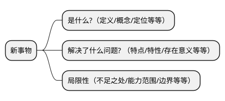

# 《深入浅出 SWR》

## 高威

### 2023-07-19

---
transition: fade-out
---

# 快速学习新事物的方法论



我想通过讲解 SWR 特性，向大家分享认识方法论，这才是我认为本次 session 最重要的内容

---
layout: default
---

# SWR 是什么？

- SWR 是一个方法（函数）
- SWR 是一个自定义的 React hook
- SWR 是一个管理 HTTP 请求的 React hook

---
transition: slide-up
level: 2
---

# SWR 的出现解决了什么问题？

HTTP 请求封装

<div grid="~ cols-2 gap-4">
<div>
未使用 SWR

```jsx
const [data, setData] = useState(null)
const [isLoading, setIsLoading] = useState(false)
const [error, setError] = useState(null)

useEffect(() => {
  async function fetchUsers() {
    try {
      setIsLoading(true)
      const response = await fetch(url).json(res => res.json())
      setData(response)
    } catch (e) {
      setError(e)
    } finally {
      setIsLoading(false)
    }
  }

  void fetchUsers()
}, [])
```

</div>
<div>
使用 SWR
```jsx
const {data, error} = useSWR(url)
```
</div>
</div>

---
layout: default
---

# 重复请求去除和响应数据缓存

<div grid="~ cols-2 gap-4">
<div>

未使用 SWR

```jsx
function Avatar() {
  const [data, setData] = useState({})

  useEffect(() => {
    fetchUsers().then(data => setData(data)).catch(err)
  }, [])

  return 
}

function App() {
  return <>
    <Avatar/>
    <Avatar/>
    <Avatar/>
    <Avatar/>
    <Avatar/>
  </>
}
```

</div>
<div>

使用 SWR

```jsx
function Avatar() {
  const {data, error} = useSWR('/api/user', fetcher)

  return 
}

function App() {
  return <>
    <Avatar/>
    <Avatar/>
    <Avatar/>
    <Avatar/>
    <Avatar/>
  </>
}
```

</div>
</div>


---
layout: default
---

# 重复请求去除和响应数据缓存

- 未使用 SWR 的代码中，当 Avatar 组件 render 的时候，同一个接口会调用五次
- 使用 SWR 后，当 Avatar 组件 render 的时候，接口调用会被 SWR 拦截，五次调用接口会处理成一次调用，服务端响应后的数据缓存在客户端的内存中，使用数据的地方直接从内存读取

---
layout: default
---

# 支持轮询

<div grid="~ cols-2 gap-4">
<div>

未使用 SWR

```jsx
const [data, setData] = useState(null)

useEffect(() => {
  function fetchUsers() {
    // http request
  }

  const timer = setInterval(fetchUsers, refreshInterval)

  return () => {
    clearInterval(timer)
  }
}, [])
```

</div>
<div>

使用 SWR

```jsx
const {data, error} = useSWR(url, {
  refreshInterval: 1000
})
```

</div>
</div>

---
layout: default
---

# 表格分页

```jsx
function App() {
  const [pageIndex, setPageIndex] = useState(0);

  return <div>
    <Page index={pageIndex}/>
    <div style={{display: 'none'}}><Page index={pageIndex + 1}/></div>
    <button onClick={() => setPageIndex(pageIndex - 1)}>Previous</button>
    <button onClick={() => setPageIndex(pageIndex + 1)}>Next</button>
  </div>
}
```

由于 SWR 的缓存，我们可以预加载下一页的页面。我们将下一页的页面渲染到隐藏的 div 中，这样 SWR
会触发下一页页面的数据获取。当用户导航到下一页时，数据就已经存在了

---
layout: default
---

# 预请求数据

```jsx
import {useState} from 'react'
import useSWR, {preload} from 'swr'

const fetcher = (url) => fetch(url).then((res) => res.json())
// 渲染 User 组件之前发起请求
preload('/api/user', fetcher)

function User() {
  const {data} = useSWR('/api/user', fetcher)
}

export default function App() {
  const [show, setShow] = useState(false)
  return (
    <div>
      <button onClick={() => setShow(true)}>Show User</button>
      {show ? <User/> : null}
    </div>
  )
}
```

---
layout: default
---

# 依赖请求

<div grid="~ cols-2 gap-4">

<div>

Admin sms 页面使用 rxjs 处理接口依赖

```jsx
zip(source$, mergeRoutingDisplayName(source$))
  .pipe(
    map(),
    reduce()
  )
  .subscribe({
    next: (result) => {
      setResult(result)
    },
    error() {
      setHasError(true)
    },
    complete() {
      setLoading(false)
    }
  })
```

</div>
<div>

使用 SWR 处理接口依赖

```jsx
function MyProjects() {
  const {data: user} = useSWR('/api/user')
  const {data: projects} = useSWR(() => '/api/projects?uid=' + user.id)
  // 传递函数时，SWR 会用返回值作为 `key`。
  // 如果函数抛出错误或返回 falsy 值，SWR 会知道某些依赖还没准备好。
  // 这种情况下，当 `user`未加载时，`user.id` 抛出错误

  if (!projects) return 'loading...'
  return 'You have ' + projects.length + ' projects'
}
```

</div>

</div>


---
layout: default
---

# 支持 Suspense 模式

React 16.6.0 推出 Suspense 组件，Suspense 主要用来解决网络 IO 的问题

<div grid="~ cols-2 gap-4">
<div>

未使用 Suspense

```jsx 
 import useSWR from "swr";

function Profile() {
  const {data, error, isLoading} = useSWR("/api/users/1")

  if (error) return <div>failed to load</div>
  if (isLoading) return <div>loading...</div>

  // 渲染数据
  return <div>hello {data.name}!</div>
}

```

</div>
<div>

使用 Suspense

```jsx
import {Suspense} from 'react'
import useSWR from 'swr'

function Profile() {
  const {data} = useSWR('/api/users/1', {suspense: true})
  return <div>hello, {data.name}</div>
}

function App() {
  return (
    <ErrorBoundary fallback={<>there are errors!</>}>
      <Suspense fallback={<div>loading...</div>}>
        <Profile/>
      </Suspense>
    </ErrorBoundary>
  )
}
```

</div>
</div>

---
layout: default
---

# 乐观更新

<div grid="~ cols-2 gap-4">
<div>
很多情况下，应用本地的数据更改是一个让人感觉快速的好方法——不需要等待远程数据源。

使用 optimisticData 选项，你可以手动更新你的本地数据，同时等待远程数据更改的完成。搭配 rollbackOnError 使用，你还可以控制何时回滚数据
</div>

<div>
```jsx
function Profile () {
  const { mutate } = useSWRConfig()
  const { data } = useSWR('/api/user', fetcher)

  return (
  <>
    <h1>My name is {data.name}.</h1>
    <button onClick={async () => {
      const options = {
        optimisticData: newUser,
        rollbackOnError(error) {
          // 如果超时中止请求的错误，不执行回滚
          return error.name !== 'AbortError'
        },
      }
      // 立即更新本地数据, 发送一个请求以更新数据, 触发重新验证（重新请求）确保本地数据正确
      mutate('/api/user', updateFn(newUser), options);
    }}>Uppercase my name!</button>
  </>
  )
}

```
</div>
</div>


---
layout: default
---

# 脱离具体业务场景谈技术没有任何意义

如何将 SWR 运用到 conversation-app 项目中

## 担忧点
- SWR 主要解决 HTTP GET 的问题，但是实际业务场景中，HTTP GET 只占一部分
- SWR 依靠 key 进行数据缓存，对于 `sms-touchpoints/{touchpointId}` 类型的 key 并不能发挥缓存作用

## SWR 对 conversation-app 的优化比较有限，需要多种优化方案(BFF/懒加载等等)一起用才能更好的优化 conversation-app 

但是对 livechat-config-ui/inbox-app 等项目的作用还需要进一步确认

---
layout: default
---

# SWR 原理

“SWR” 这个名字来自 stale-while-revalidate：一种由 HTTP RFC 5861 推广的 HTTP 缓存失效策略。
> 这种策略首先从缓存中返回数据（过期的），同时发送 fetch 请求（重新验证），当返回数据的时候用最新的数据替换运行的数据。数据的请求和替换的过程都是异步的，对于用户来说无需等待新请求返回时就能看到数据

<br/>

## HTTP RFC 5861

stale-while-revalidate 是 HTTP 的响应头 cache-control 的一个属性值，它允许立马返回一个已经过时 (stale) 的响应。与此同时浏览器又在背后默默重新发起一次请求，响应的结果被存储起来下次使用。因此它很好的隐藏了服务器或者网络的响应延时

为什么这里说允许返回一个 stale 的响应呢？如何判断响应是 stale 的呢，这是因为 stale-while-revalidate 是和 max-age 一起使用的，如果时间超过了 max-age，则是作为 stale

```bash
Cache-Control: max-age=600, stale-while-revalidate=30
```

---
layout: default
---

<div grid="~ cols-2 gap-4">

<div>

1. 表示请求的结果在 600s 内都是新鲜（stale 的反义词）的，如果在 600s 内发起了相同请求，则直接返回磁盘缓存

2. 如果在 600s~630s 内发起了相同的请求，则响应虽然已经过时（stale）了，但是浏览器会直接把之前的缓存结果返回，与此同时浏览器又在背后自己发一个请求，响应结果留作下次使用

3. 如果超过 630s 后，发起了相同请求，则这就是一个普通请求，就和第一次请求一样，从服务器获取响应结果，并且浏览器并把响应结果缓存起来

</div>

<div>
<SWR/>
</div>
</div>

## 由此可以总结：stale-while-revalidate 是一种缓存思想，而 SWR 是基于这个缓存思想的具体实现

---
layout: default
---

# SWR 功能分析

分析方法从特性的角度去实现

- HTTP 请求的封装 - 就是利用多个 `useState` 存储状态

> 源码分析

- 重复请求去除和响应数据缓存
- 轮询 - 使用 `setInterval`
- 预请求数据

> 组件未渲染之前，向服务器发送请求，把响应结果缓存，等组件渲染时直接从内存中读取

- 支持 `Suspense` 模式

---
layout: default
---

# SWR 的局限性

<State-Management/>

---
transition: fade-out
---

# 太阳底下无新事

从数据状态、UI 状态和共享状态引发的思考？

- Flux 架构是不是解决状态管理的万金油方案？
- 为什么发布订阅模式可以跨组件传递状态？
- 状态管理库从类组件到函数组件本质上发生变化没？

## 上面三个问题是对状态管理概念的深度思考

---
layout: default
---

# 快速学习新事物的方法论


这是认识新事物的方法论，用于快速了解、掌握和使用新事物。这套方法论使用范围很广，既可以运用在工作中，也可以运用在生活中


---
layout: default
---

# 本次 Session 涉及的内容

- [SlideV](https://cn.sli.dev/) - 为开发者打造的演示文稿工具
- [Handraw](https://handraw.top/) - 中文友好的手写效果白板工具
- [SWR](https://swr.vercel.app/zh-CN) - 用于数据请求的 React Hooks 库
- [PlantUML](https://plantuml.com/zh/) - 是一个允许你快速编写的组件
- [Vercel](https://vercel.com/dashboard) - 最好用的网站托管服务

---
layout: center
---

# 谢谢大家!

<uim-rocket class="text-1xl mx-3 text-red-400"/>
<uim-rocket class="text-2xl mx-2 text-red-400"/>
<uim-rocket class="text-3xl mx-2 text-red-400"/>

<style>

h1 {
  font-size:70px;
}

</style>


[//]: # (---)

[//]: # (layout: image-right)

[//]: # (image: https://source.unsplash.com/collection/94734566/1920x1080)

[//]: # (---)

[//]: # ()

[//]: # (# Code)

[//]: # ()

[//]: # (Use code snippets and get the highlighting directly![^1])

[//]: # ()

[//]: # (```ts {all|2|1-6|9|all})

[//]: # (interface User {)

[//]: # (  id: number)

[//]: # (  firstName: string)

[//]: # (  lastName: string)

[//]: # (  role: string)

[//]: # (})

[//]: # ()

[//]: # (function updateUser&#40;id: number, update: User&#41; {)

[//]: # (  const user = getUser&#40;id&#41;)

[//]: # (  const newUser = { ...user, ...update })

[//]: # (  saveUser&#40;id, newUser&#41;)

[//]: # (})

[//]: # (```)

[//]: # ()

[//]: # (<arrow v-click="3" x1="400" y1="420" x2="230" y2="330" color="#564" width="3" arrowSize="1" />)

[//]: # ()

[//]: # ([^1]: [Learn More]&#40;https://sli.dev/guide/syntax.html#line-highlighting&#41;)

[//]: # ()

[//]: # (<style>)

[//]: # (.footnotes-sep {)

[//]: # (  @apply mt-20 opacity-10;)

[//]: # (})

[//]: # (.footnotes {)

[//]: # (  @apply text-sm opacity-75;)

[//]: # (})

[//]: # (.footnote-backref {)

[//]: # (  display: none;)

[//]: # (})

[//]: # (</style>)

[//]: # ()

[//]: # (---)

[//]: # ()

[//]: # (# Components)

[//]: # ()

[//]: # (<div grid="~ cols-2 gap-4">)

[//]: # (<div>)

[//]: # ()

[//]: # (You can use Vue components directly inside your slides.)

[//]: # ()

[//]: # (We have provided a few built-in components like `<Tweet/>` and `<Youtube/>` that you can use directly. And adding your custom components is also super easy.)

[//]: # ()

[//]: # (```html)

[//]: # (<Counter :count="10" />)

[//]: # (```)

[//]: # ()

[//]: # (<!-- ./components/Counter.vue -->)

[//]: # (<Counter :count="10" m="t-4" />)

[//]: # ()

[//]: # (Check out [the guides]&#40;https://sli.dev/builtin/components.html&#41; for more.)

[//]: # ()

[//]: # (</div>)

[//]: # (<div>)

[//]: # ()

[//]: # (```html)

[//]: # (<Tweet id="1390115482657726468" />)

[//]: # (```)

[//]: # ()

[//]: # (<Tweet id="1390115482657726468" scale="0.65" />)

[//]: # ()

[//]: # (</div>)

[//]: # (</div>)

[//]: # ()

[//]: # (<!--)

[//]: # (Presenter note with **bold**, *italic*, and ~~striked~~ text.)

[//]: # ()

[//]: # (Also, HTML elements are valid:)

[//]: # (<div class="flex w-full">)

[//]: # (  <span style="flex-grow: 1;">Left content</span>)

[//]: # (  <span>Right content</span>)

[//]: # (</div>)

[//]: # (-->)

[//]: # ()

[//]: # ()

[//]: # (---)

[//]: # (class: px-20)

[//]: # (---)

[//]: # ()

[//]: # (# Themes)

[//]: # ()

[//]: # (Slidev comes with powerful theming support. Themes can provide styles, layouts, components, or even configurations for tools. Switching between themes by just **one edit** in your frontmatter:)

[//]: # ()

[//]: # (<div grid="~ cols-2 gap-2" m="-t-2">)

[//]: # ()

[//]: # (```yaml)

[//]: # (---)

[//]: # (theme: default)

[//]: # (---)

[//]: # (```)

[//]: # ()

[//]: # (```yaml)

[//]: # (---)

[//]: # (theme: seriph)

[//]: # (---)

[//]: # (```)

[//]: # ()

[//]: # ()

[//]: # ()

[//]: # ()

[//]: # ()

[//]: # (</div>)

[//]: # ()

[//]: # (Read more about [How to use a theme]&#40;https://sli.dev/themes/use.html&#41; and)

[//]: # (check out the [Awesome Themes Gallery]&#40;https://sli.dev/themes/gallery.html&#41;.)

[//]: # ()

[//]: # (---)

[//]: # (preload: false)

[//]: # (---)

[//]: # ()

[//]: # (# Animations)

[//]: # ()

[//]: # (Animations are powered by [@vueuse/motion]&#40;https://motion.vueuse.org/&#41;.)

[//]: # ()

[//]: # (```html)

[//]: # (<div)

[//]: # (  v-motion)

[//]: # (  :initial="{ x: -80 }")

[//]: # (  :enter="{ x: 0 }">)

[//]: # (  Slidev)

[//]: # (</div>)

[//]: # (```)

[//]: # ()

[//]: # (<div class="w-60 relative mt-6">)

[//]: # (  <div class="relative w-40 h-40">)

[//]: # (    )

[//]: # (    )

[//]: # (    )

[//]: # (  </div>)

[//]: # ()

[//]: # (  <div)

[//]: # (    class="text-5xl absolute top-14 left-40 text-[#2B90B6] -z-1")

[//]: # (    v-motion)

[//]: # (    :initial="{ x: -80, opacity: 0}")

[//]: # (    :enter="{ x: 0, opacity: 1, transition: { delay: 2000, duration: 1000 } }">)

[//]: # (    Slidev)

[//]: # (  </div>)

[//]: # (</div>)

[//]: # ()

[//]: # (<!-- vue script setup scripts can be directly used in markdown, and will only affects current page -->)

[//]: # (<script setup lang="ts">)

[//]: # (const final = {)

[//]: # (  x: 0,)

[//]: # (  y: 0,)

[//]: # (  rotate: 0,)

[//]: # (  scale: 1,)

[//]: # (  transition: {)

[//]: # (    type: 'spring',)

[//]: # (    damping: 10,)

[//]: # (    stiffness: 20,)

[//]: # (    mass: 2)

[//]: # (  })

[//]: # (})

[//]: # (</script>)

[//]: # ()

[//]: # (<div)

[//]: # (  v-motion)

[//]: # (  :initial="{ x:35, y: 40, opacity: 0}")

[//]: # (  :enter="{ y: 0, opacity: 1, transition: { delay: 3500 } }">)

[//]: # ()

[//]: # ([Learn More]&#40;https://sli.dev/guide/animations.html#motion&#41;)

[//]: # ()

[//]: # (</div>)

[//]: # ()

[//]: # (---)

[//]: # ()

[//]: # (# LaTeX)

[//]: # ()

[//]: # (LaTeX is supported out-of-box powered by [KaTeX]&#40;https://katex.org/&#41;.)

[//]: # ()

[//]: # (<br>)

[//]: # ()

[//]: # (Inline $\sqrt{3x-1}+&#40;1+x&#41;^2$)

[//]: # ()

[//]: # (Block)

[//]: # ($$)

[//]: # (\begin{array}{c})

[//]: # ()

[//]: # (\nabla \times \vec{\mathbf{B}} -\, \frac1c\, \frac{\partial\vec{\mathbf{E}}}{\partial t} &)

[//]: # (= \frac{4\pi}{c}\vec{\mathbf{j}}    \nabla \cdot \vec{\mathbf{E}} & = 4 \pi \rho \\)

[//]: # ()

[//]: # (\nabla \times \vec{\mathbf{E}}\, +\, \frac1c\, \frac{\partial\vec{\mathbf{B}}}{\partial t} & = \vec{\mathbf{0}} \\)

[//]: # ()

[//]: # (\nabla \cdot \vec{\mathbf{B}} & = 0)

[//]: # ()

[//]: # (\end{array})

[//]: # ($$)

[//]: # ()

[//]: # (<br>)

[//]: # ()

[//]: # ([Learn more]&#40;https://sli.dev/guide/syntax#latex&#41;)

[//]: # ()

[//]: # (---)

[//]: # ()

[//]: # (# Diagrams)

[//]: # ()

[//]: # (You can create diagrams / graphs from textual descriptions, directly in your Markdown.)

[//]: # ()

[//]: # (<div class="grid grid-cols-3 gap-10 pt-4 -mb-6">)

[//]: # ()

[//]: # (```mermaid {scale: 0.5})

[//]: # (sequenceDiagram)

[//]: # (    Alice->John: Hello John, how are you?)

[//]: # (    Note over Alice,John: A typical interaction)

[//]: # (```)

[//]: # ()

[//]: # (```mermaid {theme: 'neutral', scale: 0.8})

[//]: # (graph TD)

[//]: # (B[Text] --> C{Decision})

[//]: # (C -->|One| D[Result 1])

[//]: # (C -->|Two| E[Result 2])

[//]: # (```)

[//]: # ()

[//]: # (```mermaid)

[//]: # (mindmap)

[//]: # (  root&#40;&#40;mindmap&#41;&#41;)

[//]: # (    Origins)

[//]: # (      Long history)

[//]: # (      ::icon&#40;fa fa-book&#41;)

[//]: # (      Popularisation)

[//]: # (        British popular psychology author Tony Buzan)

[//]: # (    Research)

[//]: # (      On effectivness<br/>and features)

[//]: # (      On Automatic creation)

[//]: # (        Uses)

[//]: # (            Creative techniques)

[//]: # (            Strategic planning)

[//]: # (            Argument mapping)

[//]: # (    Tools)

[//]: # (      Pen and paper)

[//]: # (      Mermaid)

[//]: # (```)

[//]: # ()

[//]: # (```plantuml {scale: 0.7})

[//]: # (@startuml)

[//]: # ()

[//]: # (package "Some Group" {)

[//]: # (  HTTP - [First Component])

[//]: # (  [Another Component])

[//]: # (})

[//]: # ()

[//]: # (node "Other Groups" {)

[//]: # (  FTP - [Second Component])

[//]: # (  [First Component] --> FTP)

[//]: # (})

[//]: # ()

[//]: # (cloud {)

[//]: # (  [Example 1])

[//]: # (})

[//]: # ()

[//]: # ()

[//]: # (database "MySql" {)

[//]: # (  folder "This is my folder" {)

[//]: # (    [Folder 3])

[//]: # (  })

[//]: # (  frame "Foo" {)

[//]: # (    [Frame 4])

[//]: # (  })

[//]: # (})

[//]: # ()

[//]: # ()

[//]: # ([Another Component] --> [Example 1])

[//]: # ([Example 1] --> [Folder 3])

[//]: # ([Folder 3] --> [Frame 4])

[//]: # ()

[//]: # (@enduml)

[//]: # (```)

[//]: # ()

[//]: # (</div>)

[//]: # ()

[//]: # ([Learn More]&#40;https://sli.dev/guide/syntax.html#diagrams&#41;)

[//]: # ()

[//]: # (---)

[//]: # (src: ./pages/multiple-entries.md)

[//]: # (hide: false)

[//]: # (---)

[//]: # ()

[//]: # (---)

[//]: # (layout: center)

[//]: # (class: text-center)

[//]: # (---)

[//]: # ()

[//]: # (# Learn More)

[//]: # ()

[//]: # ([Documentations]&#40;https://sli.dev&#41; · [GitHub]&#40;https://github.com/slidevjs/slidev&#41; · [Showcases]&#40;https://sli.dev/showcases.html&#41;)
