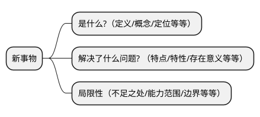

# 《深入浅出 SWR》

## 高威

### 2023-07-19

<style>
h3 {
  margin-top: 10px
}
</style>

---
transition: fade-out
clicks: 2
---

# 快速学习新事物的方法论

<v-click>



</v-click>

<v-click>

我想通过讲解 SWR，向大家分享认识方法论，这是我认为本次 Session 最重要的内容

</v-click>

---
layout: default
---

# SWR 是什么？

- SWR 是一个方法（函数）
- SWR 是一个自定义的 React Hook
- SWR 是一个管理 HTTP 请求的 React Hook

---
transition: slide-up
level: 2
---

# SWR 的出现解决了什么问题？

HTTP 请求封装

<div grid="~ cols-2 gap-4">
<div>
未使用 SWR

```jsx
const [data, setData] = useState(null);
const [isLoading, setIsLoading] = useState(false);
const [error, setError] = useState(null);

useEffect(() => {
  async function fetchUsers() {
    try {
      setIsLoading(true);
      const response = await fetch(url).json((res) => res.json());
      setData(response);
    } catch (e) {
      setError(e);
    } finally {
      setIsLoading(false);
    }
  }

  void fetchUsers();
}, []);
```

</div>

<v-click>

<div>
使用 SWR
```jsx
const {data, error} = useSWR(url)
```
</div>

</v-click>
</div>

---
layout: default
---

# 重复请求去除和响应数据缓存

<div grid="~ cols-2 gap-4">
<div>

未使用 SWR

```jsx
function Avatar() {
  const [data, setData] = useState({});
  useEffect(() => {
    fetchUsers()
      .then((data) => setData(data))
      .catch(err);
  }, []);
  return ;
}

function App() {
  // 只会发三次次 http 请求
  return (
    <>
      <Avatar/>
      <Avatar/>
      <Avatar/>
    </>
  );
}
```

</div>
<div>

使用 SWR

```jsx
function Avatar() {
  const {data, error} = useSWR("/api/user", fetcher);

  return ;
}

function App() {
  // 只会发一次 http 请求
  return (
    <>
      <Avatar/>
      <Avatar/>
      <Avatar/>
    </>
  );
}
```

</div>
</div>

---
layout: default
---

# 重复请求去除和响应数据缓存

- 未使用 SWR 的代码中，当 `Avatar` 组件 render 的时候，同一个接口会调用三次
- 使用 SWR 后，当 `Avatar` 组件 render 的时候，接口调用会被 SWR 拦截，三次调用接口会处理成一次调用，服务端响应后的数据缓存在客户端的内存中，使用数据的地方直接从内存读取

---
layout: default
---

# 支持轮询

<div grid="~ cols-2 gap-4">
<div>

未使用 SWR

```jsx
const [data, setData] = useState(null);

useEffect(() => {
  function fetchUsers() {
    // http request
  }

  const timer = setInterval(fetchUsers, refreshInterval);

  return () => {
    clearInterval(timer);
  };
}, []);
```

</div>
<div>

使用 SWR

```jsx
const {data, error} = useSWR(url, {
  refreshInterval: 1000,
});
```

</div>
</div>

---
layout: default
---

# 表格分页

```jsx
function App() {
  const [pageIndex, setPageIndex] = useState(0);

  return (
    <div>
      <Page index={pageIndex}/>
      <div style={{display: "none"}}>
        <Page index={pageIndex + 1}/>
      </div>
      <button onClick={() => setPageIndex(pageIndex - 1)}>Previous</button>
      <button onClick={() => setPageIndex(pageIndex + 1)}>Next</button>
    </div>
  );
}
```

由于 SWR 的缓存，我们可以预加载下一页的页面。我们将下一页的页面渲染到隐藏的 div 中，这样 SWR
会触发下一页页面的数据获取。当用户导航到下一页时，数据就已经存在了

---
layout: default
---

# 预请求数据

```jsx
import {useState} from "react";
import useSWR, {preload} from "swr";

const fetcher = (url) => fetch(url).then((res) => res.json());
// 渲染 User 组件之前发起请求
preload("/api/user", fetcher);

function User() {
  const {data} = useSWR("/api/user", fetcher);
}

export default function App() {
  const [show, setShow] = useState(false);
  return (
    <div>
      <button onClick={() => setShow(true)}>Show User</button>
      {show ? <User/> : null}
    </div>
  );
}
```

---
layout: default
---

# 依赖请求

<div grid="~ cols-2 gap-4">

<div>

Admin 产品 sms 页面使用 rxjs 处理接口依赖

```jsx
zip(source$, mergeRoutingDisplayName(source$))
  .pipe(map(), reduce())
  .subscribe({
    next: (result) => {
      setResult(result);
    },
    error() {
      setHasError(true);
    },
    complete() {
      setLoading(false);
    },
  });
```

</div>
<div>

使用 SWR 处理接口依赖

```jsx
function MyProjects() {
  const {data: user} = useSWR("/api/user");
  const {data: projects} = useSWR(() => "/api/projects?uid=" + user.id);
  // 传递函数时，SWR 会用返回值作为 `key`。
  // 如果函数抛出错误或返回 falsy 值，SWR 会知道某些依赖还没准备好。
  // 这种情况下，当 `user`未加载时，`user.id` 抛出错误

  if (!projects) return "loading...";
  return "You have " + projects.length + " projects";
}
```

</div>

</div>

---
layout: default
---

# 支持 Suspense 模式

React 16.6.0 推出 Suspense 组件，Suspense 主要用来解决网络 IO 的问题

<div grid="~ cols-2 gap-4">
<div>

未使用 Suspense

```jsx
import useSWR from "swr";

function Profile() {
  const {data, error, isLoading} = useSWR("/api/users/1");

  if (error) return <div>failed to load</div>;
  if (isLoading) return <div>loading...</div>;

  // 渲染数据
  return <div>hello {data.name}!</div>;
}
```

</div>
<div>

使用 Suspense

```jsx
import {Suspense} from "react";
import useSWR from "swr";

function Profile() {
  const {data} = useSWR("/api/users/1", {suspense: true});
  return <div>hello, {data.name}</div>;
}

function App() {
  return (
    <ErrorBoundary fallback={<>there are errors!</>}>
      <Suspense fallback={<div>loading...</div>}>
        <Profile/>
      </Suspense>
    </ErrorBoundary>
  );
}
```

</div>
</div>

---
layout: default
---

# 乐观更新

<div grid="~ cols-2 gap-4">
<div>
很多情况下，应用本地的数据更改是一个让人感觉快速的好方法——不需要等待远程数据源。

使用 optimisticData 选项，你可以手动更新你的本地数据，同时等待远程数据更改的完成。搭配 rollbackOnError 使用，你还可以控制何时回滚数据

</div>

<div>

```jsx
function Profile() {
  const { mutate } = useSWRConfig();
  const { data } = useSWR("/api/user", fetcher);

  return (
    <>
      <h1>My name is {data.name}.</h1>
      <button
        onClick={async () => {
          const options = {
            optimisticData: newUser,
            rollbackOnError(error) {
              return error.name !== "AbortError"; // 如果超时中止请求的错误，不执行回滚
            },
          };
          mutate("/api/user", updateFn(newUser), options); //立即更新本地数据, 发送一个请求以更新数据, 触发重新验证（重新请求）确保本地数据正确
        }}
      >
        Uppercase my name!
      </button>
    </>
  );
}


```

</div>
</div>

---
layout: default
---

# 脱离具体业务场景谈技术没有任何意义

如何将 SWR 运用到 conversation-app 项目中

## 担忧点
- SWR 主要解决 HTTP GET 的问题，但是实际业务场景中，HTTP GET 只占一部分
- SWR 依靠 key 进行数据缓存，对于 `sms-touchpoints/{touchpointId}` 类型的 key 并不能发挥缓存作用

## SWR 对 conversation-app 的优化比较有限，需要多种优化方案(BFF/懒加载等等)一起用才能更好的优化 conversation-app
但是对 livechat-config-ui/inbox-app 等项目的作用还需要进一步确认

---
layout: default
---

# SWR 原理

“SWR” 这个名字来自 stale-while-revalidate：一种由 [HTTP RFC 5861](https://datatracker.ietf.org/doc/html/rfc5861) 推广的 HTTP 缓存失效策略
> 这种策略首先从缓存中返回数据（过期的），同时发送 fetch 请求（重新验证），当返回数据的时候用最新的数据替换运行的数据。数据的请求和替换的过程都是异步的，对于用户来说无需等待新请求返回时就能看到数据

<br/>

<v-click>

## HTTP RFC 5861

stale-while-revalidate 是 HTTP 的响应头 cache-control 的一个属性值，它允许立马返回一个已经过时 (stale) 的响应。与此同时浏览器又在背后默默重新发起一次请求，响应的结果被存储起来下次使用。因此它很好的隐藏了服务器或者网络的响应延时

为什么这里说允许返回一个 stale 的响应呢？如何判断响应是 stale 的呢，这是因为 stale-while-revalidate 是和 max-age 一起使用的，如果时间超过了 max-age，则是作为 stale

```bash
Cache-Control: max-age=600, stale-while-revalidate=30
```

</v-click>

---
layout: default
---

<div grid="~ cols-2 gap-4">

<div>

<v-click>

1. 表示请求的结果在 600s 内都是新鲜（stale 的反义词）的，如果在 600s 内发起了相同请求，则直接返回磁盘缓存

</v-click>

<v-click>

2. 如果在 600s~630s 内发起了相同的请求，则响应虽然已经过时（stale）了，但是浏览器会直接把之前的缓存结果返回，与此同时浏览器又在背后自己发一个请求，响应结果留作下次使用

</v-click>

<v-click>

3. 如果超过 630s 后，发起了相同请求，则这就是一个普通请求，就和第一次请求一样，从服务器获取响应结果，并且浏览器并把响应结果缓存起来

</v-click>

</div>

<div>
<SWR/>
</div>
</div>

<v-click>

<br/>
<br/>

## `stale-while-revalidate` 是一种缓存思想，而 SWR 是基于这个缓存思想的具体实现

</v-click>

---
layout: default
---

# SWR 源码分析

HTTP 请求的封装

<div grid="~ cols-2 gap-4">

<div>
```ts
const stateDependencies = useRef<StateDependencies>({}).current

const data = isUndefined(cachedData) ? fallback : cachedData
const error = cached.error

const isValidating = isUndefined(cached.isValidating)
  ? defaultValidatingState
  : cached.isValidating
const isLoading = isUndefined(cached.isLoading)
  ? defaultValidatingState
  : cached.isLoading
```
</div>


<div>

```ts
const cached = useSyncExternalStore(
  useCallback(
  (callback: () => void) =>
    subscribeCache(
      key,
      (current: State<Data, any>, prev: State<Data, any>) => {
        if (!isEqual(prev, current)) callback()
      }
    ),
  // eslint-disable-next-line react-hooks/exhaustive-deps
  [cache, key]
  )
)
```

</div>
</div>

---
layout: default
---

# 重复请求去除和响应数据缓存

```ts
if (shouldStartNewRequest) {
  //...
  FETCH[key] = [
    currentFetcher(fnArg as DefinitelyTruthy<Key>),
    getTimestamp()
  ]
}

;[newData, startAt] = FETCH[key]
newData = await newData

if (shouldStartNewRequest) {
  setTimeout(cleanupState, config.dedupingInterval)
}

const cleanupState = () => {
  // Check if it's still the same request before deleting it.
  const requestInfo = FETCH[key]
  if (requestInfo && requestInfo[1] === startAt) {
    delete FETCH[key]
  }
}
```

---
layout: default
---
# 轮询

```txt
function next() {
  //...
  if (interval && timer !== -1) {
    timer = setTimeout(execute, interval);
  }
}

function execute() {
  if() {
  // ...
  } else {
    next()
  }
}

```

SWR 的轮询是利用 `setTimeout` 结合递归实现

---
layout: default
---

# 预请求数据

```ts
export const preload = <
  Data = any,
  SWRKey extends Key = Key,
  Fetcher extends BareFetcher = PreloadFetcher<Data, SWRKey>
>(
  key_: SWRKey,
  fetcher: Fetcher
): ReturnType<Fetcher> => {
  const [key, fnArg] = serialize(key_)
  const [, , , PRELOAD] = SWRGlobalState.get(cache) as GlobalState

  // Prevent preload to be called multiple times before used.
  if (PRELOAD[key]) return PRELOAD[key]

  const req = fetcher(fnArg) as ReturnType<Fetcher>
  PRELOAD[key] = req
  return req
}
```

组件未渲染之前，向服务器发送请求，把响应结果缓存，等组件渲染时直接从内存中读取

---
layout: default
---

# 支持 `Suspense` 模式


<div grid="~ cols-2 gap-4">
<div>

Suspense 使用原理

```jsx
// Example.jsx
const Example = () => {
  throw Promise.resolve(9);
  return <></>;
};

// App.jsx
function App() {
  return (
    <ErrorBoundary fallback={<>errors</>}>
      <Suspense fallback={<>loading</>}>
        <Example />
      </Suspense>
    </ErrorBoundary>
  );
}

```
</div>

<v-click>

<div>

SWR 启用 Suspense 逻辑

```ts
const use = (promise) => {
  if (promise.status === 'pending') {
    throw promise
  } else if (promise.status === 'fulfilled') {
    return promise.value as T
  } else if (promise.status === 'rejected') {
    throw promise.reason
  } else {
    promise.status = 'pending'
    promise.then(/**/)
    throw promise
  }
}
```
</div>

</v-click>

</div>


---
layout: default
---
# SWR 的局限性

<State-Management/>

---
transition: fade-out
---
# 太阳底下无新事

<br/>

- Flux 架构是不是解决状态管理的万金油方案？

<v-click>

> Flux 架构是状态管理的万金油方案

</v-click>

- 为什么发布订阅模式可以跨组件传递状态？

<v-click>

> 因为发布订阅模式具有中心化的 Store, 存储了 Listeners

</v-click>

- 状态管理库从类组件到函数组件本质上发生变化没？

<v-click>

> 本质上没有发生变化

</v-click>

<v-click>

<br/>
<br/>
<br/>

## 上面三个问题是对状态管理的深度思考

</v-click>

---
 layout: default
---

# 快速学习新事物的方法论


这是认识新事物的方法论，用于快速了解、掌握和使用新事物。这套方法论使用范围很广，既可以运用在工作中，也可以运用在生活中

---
layout: default
--- 
# 本次 Session 涉及的内容

## 工具

- [SlideV](https://cn.sli.dev/) - 为开发者打造的演示文稿工具
- [WebStorm](https://www.jetbrains.com/zh-cn/webstorm/) - 用于开发 swr-slidev 项目
- [Handraw](https://handraw.top/) - 中文友好的手写效果白板工具
- [PlantUML](https://plantuml.com/zh/) - 是一个允许你快速编写的组件
- [Vercel](https://vercel.com/dashboard) - 最好用的网站托管服务

## 参考链接
- [SWR](https://swr.vercel.app/zh-CN) - 用于数据请求的 React Hooks 库
- [花了好几个小时，终于懂了什么叫 SWR](https://juejin.cn/post/7192467269316788280)

---
layout: center
--- 

# 谢谢大家!

<uim-rocket class="text-1xl mx-3 text-red-400"/>
<uim-rocket class="text-2xl mx-2 text-red-400"/>
<uim-rocket class="text-3xl mx-2 text-red-400"/>

<style>
h1 {
  font-size:70px;
}
</style>